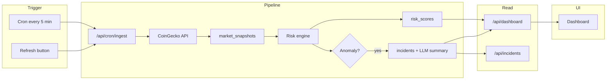

# Crypto Market Intelligence Engine

Real-time monitoring of crypto volatility and liquidity; detects anomalies via rolling z-scores, computes composite risk scores, and surfaces alerts—all in one dashboard.

## Quick start

1. **Clone and install**

   ```bash
   cd crypto-market-intel
   npm install
   ```

2. **Database**

   Create a Postgres database (e.g. [Neon](https://neon.tech) or Vercel Postgres). Copy the connection string and run the schema:

   ```bash
   psql $DATABASE_URL -f scripts/schema.sql
   ```

3. **Environment**

   Copy `.env.example` to `.env.local` and set at least:

   - `DATABASE_URL` — your Postgres connection string
   - Optionally `CRON_SECRET` if you want to protect `/api/cron/ingest`
   - Optionally `GROQ_API_KEY` ([console.groq.com](https://console.groq.com)) for AI-generated one-sentence incident summaries

4. **Run**

   ```bash
   npm run dev
   ```

   Open [http://localhost:3000](http://localhost:3000). Click **Refresh** to fetch market data (CoinGecko) and backfill risk scores. After a couple of refreshes you’ll see risk scores and charts.

## API

- `GET /api/dashboard` — latest risk scores and chart data
- `GET /api/incidents` — recent incidents
- `GET /incidents/[id]` — incident report page (title, AI summary, raw metrics)
- `GET /api/cron/ingest` — run pipeline (guard with `CRON_SECRET` in production)
- `GET /api/refresh` — same as ingest, for manual refresh from the UI

## Tech

- Next.js 14 (App Router), TypeScript, Tailwind, Recharts
- Vercel Postgres (or Neon), CoinGecko API, Groq (optional LLM summaries)
- Risk engine: rolling mean/std, z-scores, composite risk
- Incidents get an optional one-sentence AI summary (Groq) when thresholds are breached

## Architecture



- **Trigger:** External cron (e.g. cron-job.org) or the in-app **Refresh** button calls `/api/cron/ingest`.
- **Pipeline:** Ingest fetches markets from CoinGecko, writes `market_snapshots`, computes z-scores and composite risk, writes `risk_scores`. If volatility or volume z-score breaches thresholds (2.5σ / 2σ), it creates an incident and optionally generates an AI summary (Groq) and writes to `incidents`.
- **Read:** The dashboard and incident report page read from `/api/dashboard` and `/api/incidents` (and `/incidents/[id]` for a single report).

## Deploy

1. **Push to GitHub** (if you haven’t already), then import the repo in [Vercel](https://vercel.com) and deploy.

2. **Environment variables** (Vercel project → Settings → Environment Variables):
   - `DATABASE_URL` — production Postgres connection string (e.g. Neon)
   - `GROQ_API_KEY` — optional; for AI-generated incident summaries
   - `CRON_SECRET` — optional but recommended; a random string used to protect the ingest endpoint

3. **Database:** Run the schema once against your production DB:
   ```bash
   psql "$DATABASE_URL" -f scripts/schema.sql
   ```
   (Or paste the contents of `scripts/schema.sql` into Neon’s SQL Editor and run.)

4. **Cron (optional):** To refresh market data every 5 minutes without clicking Refresh:
   - Go to [cron-job.org](https://cron-job.org) and create a job.
   - URL: `https://your-app.vercel.app/api/cron/ingest`
   - Schedule: every 5 minutes.
   - If you set `CRON_SECRET`, add a header: `Authorization: Bearer YOUR_CRON_SECRET` or append `?secret=YOUR_CRON_SECRET` to the URL.

Your live dashboard will be at `https://your-app.vercel.app`.

---

## CV / Portfolio

You can use this in a resume or portfolio:

**Crypto Market Intelligence Engine** — [Live link]

- Real-time crypto volatility and liquidity monitoring with rolling z-score anomaly detection and composite risk scoring.
- Built a cloud-deployed pipeline (Next.js, Neon Postgres, CoinGecko) with in-dashboard anomaly messages and AI-generated incident summaries (Groq).
- Designed for one-link demo: risk gauges, time-series charts, and incident reports with no signup required.
